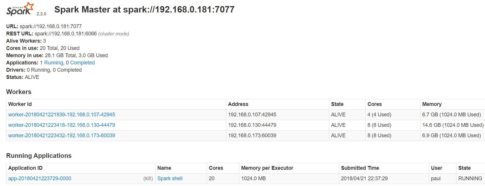
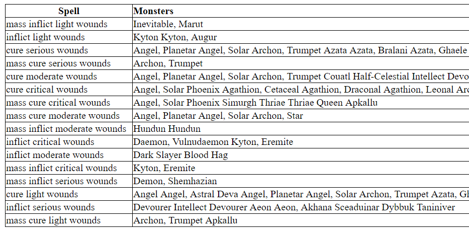
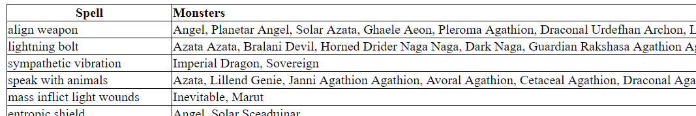

# uqac-bdd-devoir2

<h2>Rapport du devoir 2 de Bases de données réparties - Hiver 2018</h2>
<b>David Delemotte, Paul Michaud, Rénald Morice, Loïc Bothorel</b>

---

<h3>Exercice 1</h3>

---

<h4>Partie 1</h4>

`Fichiers` &nbsp;
Crawler: <i>crawlers/crawler.py</i> &nbsp;&nbsp; - &nbsp;&nbsp; Json obtenu: <i>crawlers/allMonsters.json</i> 

`Ce qu'on a fait:`  Nous avons réalisé le crawler en Python puis stocké les données au format JSON (voir le dossier crawlers).

---
<h4>Partie 2</h4>

`Fichiers` &nbsp;
Code scala: <i>src/main/scala/Exercice1</i> 

`Ce qu'on a fait` 
Nous avons mis les données crawlées dans un RDD Spark pour que toutes les opérations puissent être parallélisées entre nos 4 machines. Pour cela, on défini un Master et des Slaves (les 3 autres). Quelqu'un lance le master puis les Slaves font la commande suivante pour le rejoindre: <i>./spark-class org.apache.spark.deploy.worker.Worker spark://IP_MASTER:PORT</i>. Depuis l'interface on peut voir que les slaves ont bien réussi à rejoindre le master, on voit aussi la running application et la conso de chaque worker:

  

---

<h4>Partie 3</h4>

`Fichiers`   
Code scala: <i>src/main/scala/Exercice1</i>  
Résultat sorts de healing: <i>src/main/scala/Exercice1/batchViewHealSpellMonsters.html</i> 
Résultat bonus tous les sorts: <i>src/main/scala/Exercice1/batchViewSpellMonsters.html</i> 

`Ce qu'on a fait` 
Nous avons créé une batch view permettant à Pito de visualiser rapidement les créatures qui peuvent le tirer d’affaire grâce à un reduceByKey. C'est à dire tout les sorts de healing. Le résultat est le suivant (sort | monstres associés):

  

Nous l’avons également fait pour tous les sorts (bonus) en faisant un groupByKey. Voici une petite partie du résultat, vous pouvez consulter le fichier html complet dans le dossier de l'exercice 1.

  

---

<h3>Exercice 2</h3>

---

<h4>Combat 1. Solar vs Éclaireurs Orcs</h4>

`Fichiers:` &nbsp;  Code principal: <i>src/main/scala/Exercice2/Combat1</i> &nbsp;&nbsp; - &nbsp;&nbsp; Nos monstres: <i>src/main/Exercice2/Bestiary</i> 

`Ce qu'on a fait` 

C'est un combat entre le Solar et les monstres pour protéger Pito, en utilisant GraphX de Spark. Le code spécifique au combat 1 se trouve dans  <i>src/main/scala/Exercice2/Combat1</i>.

On commence par créer nos RDD de vertex et de edge dans <i>Combat1.scala</i>, puis on appelle la boucle principale qui se trouve dans <i>Game.scala</i>, voici son fonctionnement: 

On réalise un certain nombre d'itérations (jusqu'à atteindre une condition d'arrêt). Lors de chaque itérations, différentes étapes qui font évoluer le graphe ont lieues.

<b>1. Pour chaque monstre, on choisi et on met à jours la cible à attaquer, de la façon suivante:</b>
- Dans le premier AgregateMessages, on détermine pour chaque monstre l'énnemi le plus interessant à attaquer.
- Dans le premier JoinVertixes, on met à jours le monstre avec la bonne target (pour cela, on créé une nouvelle instance du monstre avec la nouvelle target, qu'on return pour remplacer la précédente, car si on modifie directement le monstre ça n'est pas pris en compte).

<b>2. On réalise ces attaques en faisant perdre le nombre correct de HP:</b>

- Dans le deuxiéme AgregateMessages, on fait le calcul des domages pour chaque monstre (principe du map reduce)
- Dans le deuxiéme joinVertixes, on fait perdre les HP à chaque monstre (pour cela, on créé une nouvelle instance du monstre avec les nouveaux HP, qu'on return pour remplacer la précédente, car si on modifie directement le monstre ça n'est pas pris en compte).

<b>3. Le nouvel du graphe est affichée dans la console.</b>
- Le nom du monstre (son ID, ses HP) --DISTANCE--> le monstre qu'il attaque(son ID, ses HP)

<b>4. On vérifie les conditions d'arrêt</b>
- On compte le nombre d'alliés et d'ennemis encore vivant en faisant un filter suivi d'un count.
- Si il reste 0 ennemis: Pito est sauvé :D
- Si il reste 0 alliés: Pito à perdu :(
- Sinon, on continue la boucle pour faire une nouvelle itération.

Voici le résultat final, on a réussi à sauver Pito ! 
 IMAGE CONSOLE 

<h4>Combat 2. Les Orcs et le dragon vert attaquent le village de Pito</h4>

`Fichiers:` &nbsp;  Code principal: <i>src/main/scala/Exercice2/Combat2</i> &nbsp;&nbsp; - &nbsp;&nbsp; Nos monstres: <i>src/main/Exercice2/Bestiary</i> 

`Ce qu'on a fait` 

Ce combat reprends les bases du premier, mais maintenant c'est plus compliqué ! Il y a beaucoup de monstres alors on créé certains RDD à partir d'un array créé avec une boucle for. Il y a aussi de nouvelles attaques pour les monstres.

---

<h4>Question ouverte, Comment gérer efficacement un système de distance 3D avec un graphe d’agents distribué? On met la distance sur le sommet? sur l’arête? problèmes de collision etc.</h4>
---

Travailler avec des vecteurs.
