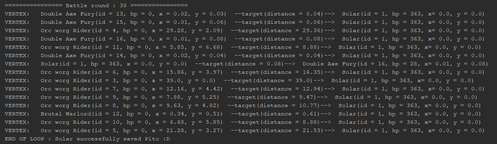

# uqac-bdd-devoir2

<h2>Rapport du devoir 2 de Bases de données réparties - Hiver 2018</h2>
<b>David Delemotte, Paul Michaud, Rénald Morice, Loïc Bothorel</b>

Ce rapport explique et montre les résultats du travail réalisé dans les deux exercices du devoir 2.

---

<h3>Exercice 1</h3>

---

<h4>Partie 1</h4>

`Fichiers` &nbsp;
Crawler: <i>crawlers/crawler.py</i> &nbsp;&nbsp; - &nbsp;&nbsp; Json obtenu: <i>crawlers/allMonsters.json</i><br>

`Ce qu'on a fait:` <br>Nous avons réalisé le crawler en Python en parcourant les bestiaires de paizo.com, puis nous avons stocké les données au format JSON dans le dossier <i>crawlers</i>. Il contient plus de 1400 monstres ! En voici un petit aperçu:
```json
[
    {
        "name": "Seaweed Siren",
        "spells": [
            "shatter",
            "charm monster",
            "confusion",
            "bestow curse"
        ]
    },
    ...
]
```
---
<h4>Partie 2</h4>

`Fichiers` &nbsp;
Code scala: <i>src/main/scala/Exercice1</i><br>

`Ce qu'on a fait`<br>
Nous avons mis les données crawlées dans un RDD Spark pour que toutes les opérations puissent être parallélisées entre nos 4 machines. Pour cela, on défini un Master et des Workers, quelqu'un lance le master puis les Workers font la commande suivante pour le rejoindre: <i>./spark-class org.apache.spark.deploy.worker.Worker spark://IP_MASTER:PORT</i>. Depuis l'interface on peut voir que les workers ont bien réussi à rejoindre le master et la running application pour lesquelles les opérations sont parallélisées:
<p align="center">
  <br>
  <i>L'interface de spark ou l'on voit la conso de nos workers lors de la parallélisation des tâches</i>
</p>

<p align="center">
   <br>
  <i>La connexion d'un Worker au Master</i>
</p>

---

<h4>Partie 3</h4>

`Fichiers`  <br>
Code scala: <i>src/main/scala/Exercice1</i> <br>
Résultat sorts de healing: <i>src/main/scala/Exercice1/batchViewHealSpellMonsters.html</i><br>
Résultat bonus tous les sorts: <i>src/main/scala/Exercice1/batchViewSpellMonsters.html</i><br>

`Ce qu'on a fait`<br>
Nous avons créé une batch view permettant à Pito de visualiser rapidement les créatures qui peuvent le tirer d’affaire grâce à un reduceByKey. C'est à dire tout les sorts de healing. Le résultat est le suivant:

<p align="center">
  
</p>

Nous l’avons également fait pour tous les sorts (bonus) en faisant un groupByKey. Voici une petite partie du résultat, vous pouvez consulter le fichier html complet dans le dossier de l'exercice 1:

<p align="center">
  
</p>

---

<h3>Exercice 2</h3>

---

<h4>Combat 1. Solar vs Éclaireurs Orcs</h4>

`Fichiers:` &nbsp;  Code principal: <i>src/main/scala/Exercice2/Combat1</i> &nbsp;&nbsp; - &nbsp;&nbsp; Nos monstres: <i>src/main/Exercice2/Bestiary</i><br>


`Ce qu'on a fait`<br>

C'est un combat entre le Solar et les monstres pour protéger Pito, en utilisant GraphX de Spark. On commence par créer nos RDD de vertex et de edge dans <i>Combat1.scala</i>, puis on appelle la boucle principale qui se trouve dans <i>Game.scala</i>. On réalise un certain nombre d'itérations de cette boucle et lors de chaque itération, différentes étapes font évoluer le graphe:

<b>1. Tous les 10 rounds, on enlève les monstres morts du RDD et on réalise un checkpoint() sur le RDD pour reset son lineage Graph.</b>

```scala
if(roundCounter%10==0){
    myGraph = myGraph.subgraph(vpred = (_, attr) =>  attr.hp > 0)
    myGraph.checkpoint()
}
```

<b>2. Pour chaque monstre, on commence par réaliser les actions qui ne dépendent que de lui de manière isolée :</b>
- Régénération
- Déplacement (en fonction de la vitesse de chaque monstre)
- Etat touché pendant le round remis à false (utile pour l'affichage)


```scala
val newVerticesMove = myGraph.vertices.map(vertex => {
    if(vertex._2.hp > 0){
        vertex._2.regenerate()
        vertex._2.move()
        vertex._2.hurtDuringRound = false
    }
    vertex
})

myGraph = Graph(newVerticesMove, myGraph.edges)
```

<i>A noter que toutes les fonctions qui regénèrent, font les mouvements, calculent les dommages reçus ect... se trouvent dans LivingEntity (classe parente de tout les monstres).</i>

<b>3. Pour chaque monstre, on choisi et on met à jours la cible à attaquer, de la façon suivante:</b>
- Dans le AgregateMessages, on détermine pour chaque monstre l'énnemi le plus interessant à attaquer.
- Dans le JoinVertixes, on met à jours le monstre avec la bonne target (pour cela, on créé une nouvelle instance du bon type de monstre avec la nouvelle target, qu'on return pour remplacer la précédente pour que ce soit pris en compte, d'ou l'utilisation du design pattern Prototype).

```scala
val targetMessages = myGraph.aggregateMessages[(LivingEntity, Position)](
    sendTargetMsg,
    mergeTargetMsg,
    fields
)

myGraph = myGraph.joinVertices(targetMessages) {

    (_, fighter, tupleTarget) => {

        val newFighter = LivingEntityPrototype.create(fighter)
        newFighter.target = tupleTarget._1
        newFighter
    }
}
```

<i>Détail des fonctions sendTargetMsg() et mergeTargetMsg() en bas du fichier Game.scala</i>

<b>4. Chaque monstre subit la somme des dégâts des autres monstres qui l'attaquent:</b>
- Dans le AgregateMessages, on fait le calcul des dommages que va recevoir chaque monstre
- Dans le joinVertixes, on fait perdre les HP à chaque monstre (pour cela, on créé une nouvelle instance du bon type de monstre avec les nouveaux HP).

```scala
val damageMessages = myGraph.aggregateMessages[Int](
    sendDamageMsg,
    mergeDamageMsg,
    fields
)

myGraph = myGraph.joinVertices(damageMessages) {

    (_, damageReceiver, damages) => {

        if(damages>0){
            val newDamageReceiver = LivingEntityPrototype.create(damageReceiver)
            newDamageReceiver.takeDamage(damages)
            newDamageReceiver
        }else
            damageReceiver

    }
}
```
<i>Détail des fonction sendDamageMsg() et mergeDamageMsg() en bas du ficher Game.scala</i>

<b>5. Les vertices sont streamées en Websocket sur <i>ws://localhost:8089/fight</i> :</b>

```scala
val webSocketClient = WebSocket().open("ws://localhost:8089/fight")

webSocketClient.send(net.liftweb.json.Serialization.write(roundVerticesRDD))
```

<b>5.2 (Optionnel) Il est possible d'afficher les vertices dans la console du programme Scala en décommentant la ligne suivante :</b>

```scala
GraphConsole.printLivingEntityGraphVertices(myGraph)
```

L'affichage en console est du type :

- Le nom du monstre (ID, HP, POSITION) --DISTANCE-A-SA-CIBLE--> le monstre qu'il attaque(ID, HP, POSITION)

<p align="center">
  
</p>


<b>5
    . On vérifie les conditions d'arrêt</b>
- On compte le nombre d'alliés et d'ennemis encore vivant en faisant un filter suivi d'un count.
- Si il reste 0 ennemis: Pito est sauvé :D
- Si il reste 0 alliés: Solar est mort, Pito à perdu :(
- Sinon, on continue la boucle pour faire une nouvelle itération.

```scala
val nbBadGuysAlive = myGraph.vertices.filter{vertex =>vertex._2.team =="BadGuys" && vertex._2.hp >0}.count
val nbGoodGuysAlive = myGraph.vertices.filter{vertex =>vertex._2.team =="GoodGuys" && vertex._2.hp >0}.count

if(nbBadGuysAlive == 0){
    println("END OF LOOP : Solar successfully saved Pito :D")
    return
}
else if(nbGoodGuysAlive == 0){
    println("END OF LOOP : Unfortunatly, Solar and Pito died! Bad guys won :(")
    return
}
```

Voici le résultat final, la plupart du temps Pito est sauvé car le Solar est trés puissant grâce à son bouclier et sa regénération ! Il faut quand même une quarantaine de rounds pour tuer tout les énemis (les Double Axe Fury sont trés résistants).

<p align="center">
  
</p>

Nous avons également fait un affichage graphique mais dans un autre langage (jQuery, PHP et HTML). Les données sont transférées à l'interface via Websocket en temps réel pour un affichage du combat en live. <a href="https://docs.google.com/document/d/1FYRVSCEYBRJ9QSq5nRjY9qPYKdYzW8SwYfZ03rMwpbw/edit?usp=sharing">Cliquer ici</a> pour voir les instructions de configuration et de lancement de l'interface. Voici le résultat:

GIF ANIME

<h4>Combat 2. Les Orcs et le dragon vert attaquent le village de Pito</h4>

`Fichiers:` &nbsp;  Code principal: <i>src/main/scala/Exercice2/Combat2</i> &nbsp;&nbsp; - &nbsp;&nbsp; Nos monstres: <i>src/main/Exercice2/Bestiary</i><br>

`Ce qu'on a fait`<br>

Ce combat reprends les bases du premier, mais maintenant c'est plus compliqué ! Il y a beaucoup de monstres alors on créé certains RDD à partir d'un array créé avec une boucle for. Il y a aussi de nouvelles attaques pour les monstres et un dragon. On ne va pas tout réexpliquer en détail car c'est exactement le même principe que le combat 1. On peut ausi visualiser le combat 2 via l'interface (qui s'adapte automatiquement quelque soit le combat), il suffit de lancer le combat 2 au lieu du combat 1. Voici le résultat:


---

<h4>Question ouverte, Comment gérer efficacement un système de distance 3D avec un graphe d’agents distribué? On met la distance sur le sommet? sur l’arête? problèmes de collision etc.</h4>
---

Travailler avec des vecteurs.
